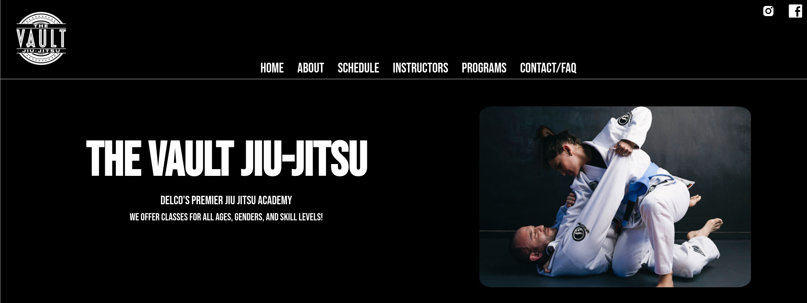
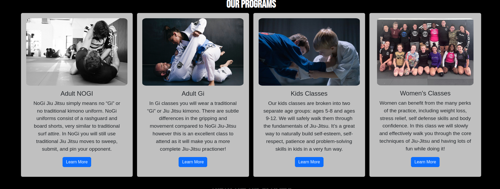
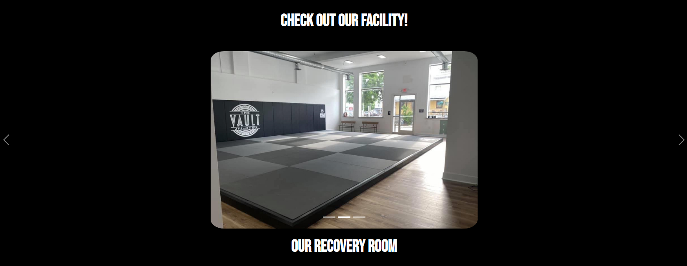
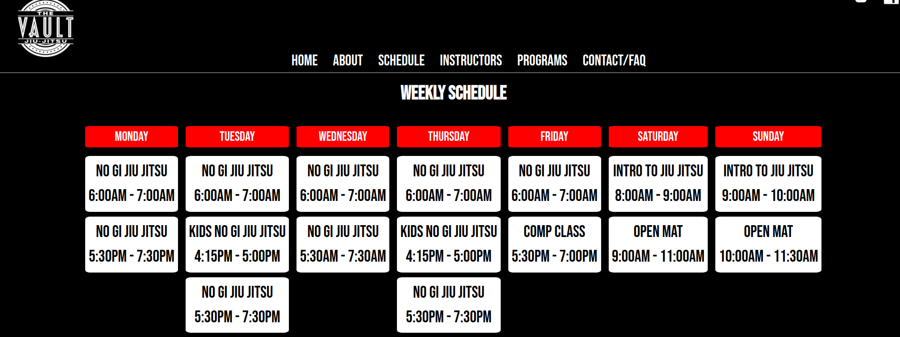
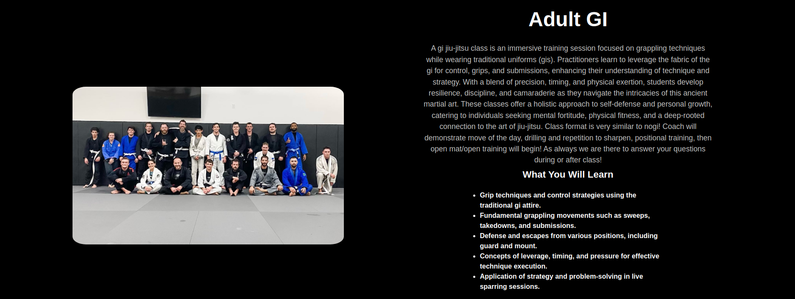
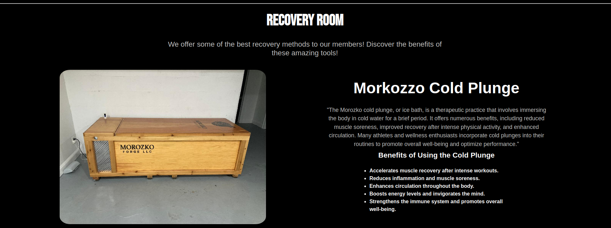
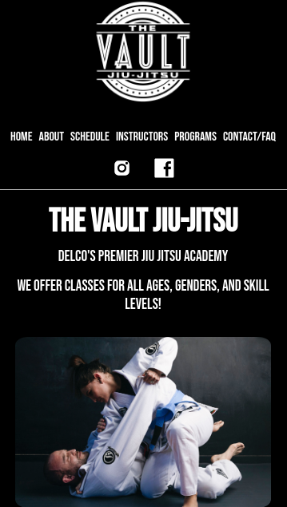

<h1>About This Project</h1> 
This project aimed to enhance my local jiu-jitsu school's website through a comprehensive refactor, integrating improved styling, animations, and instructor bios, while showcasing the school's amenities like the sauna and cold plunge. Developed with ReactJS, it provided valuable practice with React hooks such as state, effects, and refs, as well as CSS animations for engaging fade-in and slide-in effects.

 

<h1>What I learned</h1>
    <ul>
  <li>Explored CSS animations and implemented animations triggered by focus</li>
<li>Utilized Bootstrap components for enhanced UI design</li>
<li>Mastered the useRef hook in ReactJS for efficient DOM manipulation</li>
<li>Gained further practice and experience with react hooks such as useStat and useEffect</li>
<li>Implemented React Router for seamless navigation across components</li>
<li>Applied responsive design principles for optimal performance on various devices</li>
<li>Expanded flexbox and CSS expertise by crafting intricate layouts with multiple flex containers</li>
<li>Using SASS/SCSS to keep styles clean and organized. Each component has their own dedicated stylesheet</li>
    </ul>

 <h1>Built With</h1>

<h1>Getting Started</h1>

To get project cloned locally: git clone git@github.com:alecnissen/Vault-Jiu-Jitsu.git

then `npm install` which will install all dependency's and packages.

<h1>Features</h1>

- Header buttons, main title and subtitle will have animations applied to them. Header buttons will fade in, main title and subtitle text will slide in.

- Bootstrap cards to display programs offered 

- Image carousel to show user images of the facility.

- Updated class schedule.

- Component which shows class details and what you will be specifically learning in each class

- Component which will show the gyms amenities such as the sauna and cold plunge. While listing more details on the benefits and science. 

- Mobile responsive 

<h1>Acknowledgments</h1> Thank you to everyone within The Odin Project Curriculum from the bottom of my heart! Thank you to anyone who helped me in the discord channels. I promise to help others throughout this journey.

<h1>Contact</h1>

Creator: Alec J Nissen
 
E-Mail: alecnissen@yahoo.com
 
GitHub: https://github.com/alecnissen/Vault-Jiu-Jitsu
 
Live Link: https://vaultbjj.netlify.app
